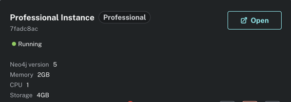
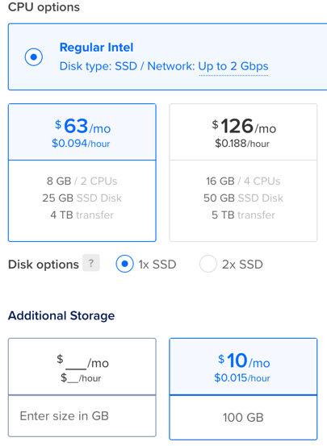

# Switching to self hosted neo4j

Why? Cost

Right now I'm paying $120 a month for this: 

- 1 cpu
- 2 gb ram
- 4gb of storage

And for $73 a month on digital ocean I can get this:

- 2 cpus
- 8 gb ram
- 25 ggb ssd + 100 gb block storage
- 4 TB of bandwidth

The only difference is that I'd have to use the community version of neo4j, self host it, and add a queue to ensure consistent load. The other thing is, all the data that goes into neo4j comes from mongo, so if it crashes, I can recreate it.

Eventually we'll have to get it to a point where it will have a date cutoff of events it's considering.

## Initial Plan

Follow this guide to set it up:

https://www.digitalocean.com/community/tutorials/how-to-install-and-configure-neo4j-on-ubuntu-22-04

## Plan to improve performance

1. Set up indexes for my queries
2. Batch writes to happen every 30 seconds
3. Set up a queue to ensure consistent load

## High Level Priorities

1. Get the existing stack running as a set of docker containers locally
    - [ ] neo4j database
    - [ ] mongo db
    - [ ] nostr workers scripts
    - [ ] django web app
2. Set up my own nostr relay to support DVM only events, this way I don't bog down existing relays
3. Get some multi-DVM chains as test data running on DVM Dash
   - [ ] Figure out how DVM chains can exist via existing NIP-90
   - [ ] Think about how we would do langgraph dvm chains
   - [ ]
4. Get multi-DVM debug graphs working with some examples
   - [ ] Figure out how to write the queries to support this
   - [ ] Get a demo working that users can run locally
5. Evaluate whether we need any other major features before we worry about optimizing for performance on the deployed version
6. Start building the performance version for the live webapp

## Steps to do this:

1. Install community neo4j on a digital ocean droplet as a test
   - make sure to consider optimizations like:
     - Use EXT4 or XFS file systems for better performance4 
     - Store data and transaction logs on separate drives4 
     - Configure the JVM heap space and garbage collector for optimal performance
       - Carefully calculate and configure memory settings using the rule: Total Physical Memory = Heap + Page Cache + OS Memory
2. Migrate all the data from mongo db over to it
3. Run dvmdash locally using the droplet neo4j and see if it can do everything I need for producing debug graphs, measure performance
4. Test my compute_stats script to see if those queries work
5. Test with listen_to_events_script as is (no batch writes) and monitor the performance
6. Add indexes for all my queries and measure performance
7. Rewrite my listen_to_events_script to do batch writes and measure the change in performance

